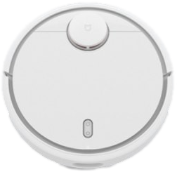

# ioBroker mihome-vacuum adapter

[](https://www.paypal.com/paypalme/MeisterTR)


[](https://www.npmjs.com/package/iobroker.mihome-vacuum)


[](https://weblate.iobroker.net/engage/adapters/?utm_source=widget)
[](https://www.npmjs.com/package/iobroker.mihome-vacuum)

[Deutsche Dokumentation](README_de.md)

The mihome-vacuum adapter connects ioBroker to compatible Xiaomi ecosystem robot vacuum cleaners. It supports local control through the robot's IP
address and token, optional Xiaomi Cloud device discovery and maps, room cleaning, timers, cleaning history, consumable information, and dedicated VIS
1 and VIS 2 widgets.

Supported device families include Roborock/rockrobo, Viomi, and Dreame. The exact commands, map functions, rooms, mop controls, dock controls, and
consumable states depend on the model and firmware.

## Supported devices and features

The following models are explicitly documented as supported. Other models from the same device families may work with the matching manager, but are
not guaranteed until they have been tested. Available functions can also vary with the installed firmware.

| Device                 | Basic control | Cleaning history | Room cleaning | Map |
|:-----------------------|:-------------:|:----------------:|:-------------:|:---:|
| `viomi.vacuum.v6`      |      ✅       |        —         |       —       |  —  |
| `viomi.vacuum.v7`      |      ✅       |        —         |       —       |  —  |
| `viomi.vacuum.v8`      |      ✅       |        —         |       —       |  —  |
| `viomi.vacuum.v19`     |      ✅       |        —         |       —       |  —  |
| `rockrobo.vacuum.v1`   |      ✅       |        ✅        |       —       | ✅  |
| `roborock.vacuum.s4`   |      ✅       |        ✅        |      ✅       | ✅  |
| `roborock.vacuum.s5`   |      ✅       |        ✅        |      ✅       | ✅  |
| `roborock.vacuum.s5e`  |      ✅       |        ✅        |      ✅       | ✅  |
| `roborock.vacuum.m1s`  |      ✅       |        ✅        |      ✅       | ✅  |
| `roborock.vacuum.a10`  |      ✅       |        ✅        |      ✅       | ✅  |
| `roborock.vacuum.a15`  |      ✅       |        ✅        |      ✅       | ✅  |
| `dreame.vacuum.r2205`  |      ✅       |        ✅        |       —       |  —  |
| `dreame.vacuum.r2216o` |      ✅       |        ✅        |       —       |  —  |
| `dreame.vacuum.r2228o` |      ✅       |        ✅        |       —       |  —  |
| `dreame.vacuum.p2008`  |      ✅       |        ✅        |       —       |  —  |
| `dreame.vacuum.p2009`  |      ✅       |        ✅        |       —       |  —  |
| `dreame.vacuum.p2027`  |      ✅       |        ✅        |       —       |  —  |
| `dreame.vacuum.p2028`  |      ✅       |        ✅        |       —       |  —  |
| `dreame.vacuum.p2029`  |      ✅       |        ✅        |       —       |  —  |
| `dreame.vacuum.p2036`  |      ✅       |        ✅        |       —       |  —  |
| `dreame.vacuum.p2041o` |      ✅       |        ✅        |       —       |  —  |
| `dreame.vacuum.p2114a` |      ✅       |        ✅        |       —       |  —  |
| `dreame.vacuum.p2148o` |      ✅       |        ✅        |       —       |  —  |
| `dreame.vacuum.p2156o` |      ✅       |        ✅        |       —       |  —  |

`✅` means that the function is supported for the documented model. `—` means that the adapter does not currently provide that function for the model.

## Disclaimer

All product and company names, logos, and trademarks mentioned in this project belong to their respective owners. Xiaomi, Mi Home, Roborock, Viomi,
Dreame, and their associated names, logos, and trademarks are the property of their respective owners. Their use is solely for identification and does
not imply any affiliation, sponsorship, or endorsement. This is a private, non-commercial open-source project developed for recreational purposes.

## Sentry

**This adapter uses Sentry libraries to automatically report exceptions and code errors to the developers.** For more details and instructions on
disabling error reporting, please refer to the [Sentry Plugin documentation](https://github.com/ioBroker/plugin-sentry). Sentry reporting is available
with js-controller 3.0 and newer.

## Requirements

- Node.js 22.13 or newer
- js-controller 7.2.2 or newer
- Admin 7.8.23 or newer
- The ioBroker host and robot should be reachable through the same local network
- A valid local device token is required for local UDP control

Xiaomi Cloud is optional for normal local control. It is used for convenient device discovery and Xiaomi Cloud maps.

## Quick start

1. Install the adapter and create an instance.
2. Open the instance configuration and select the **Connection** tab.
3. Select the Xiaomi region in which the vacuum is registered.
4. Click **Create Xiaomi login link**.
5. Open the displayed link and confirm the Xiaomi login in the browser.
6. Return to ioBroker after the cloud status changes to **Authenticated**.
7. Click **Get devices** and select the vacuum from the device list.
8. Check the automatically filled token, IP address, model, and manager.
9. Save the configuration and verify that `info.connection` becomes `true`.


The login is performed through a Xiaomi login link. No QR image is generated by the adapter. The link expires after a short time; create a new link if
the status changes to `expired` or `error`.

The selected device normally supplies the local token, IP address, and model automatically. The token is encrypted in the ioBroker instance
configuration and masked in the UI. Use the eye button only when you intentionally need to view or copy it.

Never publish a device token, Xiaomi login link, cookie, cloud session, or unredacted debug response in an issue or forum post.

## Local setup without Xiaomi Cloud

Local control does not depend on an active Xiaomi Cloud session. If the local token, IP address, and model are already known, enter them in **Manual
settings**:

- **Token:** local hexadecimal device token
- **IP address:** current local address of the robot
- **Model:** model identifier such as `roborock.vacuum.s5`
- **Manager:** normally detected automatically; manually choose Roborock, Viomi, or Dreame only when necessary
- **Vacuum port:** normally `54321`
- **Own port:** local UDP port used by this adapter instance, normally `53421`

Assign a fixed DHCP lease to the robot so its IP address does not change.

### Obtaining the token manually

Obtaining the local device token manually can be the most difficult part of a setup without Xiaomi Cloud discovery. The following external guide
describes one possible procedure for several Xiaomi and Roborock models:

[Token extraction guide (German)](https://www.smarthomeassistent.de/token-auslesen-roborock-s6-roborock-s5-xiaomi-mi-robot-xiaowa/)

This is a third-party guide and may not work with every model, firmware, or current Mi Home app version. Treat the token like a password: store it
securely and never publish it in logs, screenshots, issues, or forum posts.

## Configuration

### Connection

The Connection tab contains Xiaomi Cloud authentication, device discovery, and the local settings used to communicate directly with the vacuum.

- A successful cloud login is stored as a protected, encrypted session.
- **Get devices** only becomes available after authentication.
- Selecting a detected vacuum fills missing local settings and replaces an outdated token when necessary.
- The login link is cleared after a successful login or after it expires.
- Deleting the stored token takes effect when the configuration is saved.

### General settings


- **Request status interval:** how often the current robot status is requested. Very short intervals increase network and robot load.
- **Request Wi-Fi status interval:** how often signal information is refreshed.
- **Enable map from Xiaomi Cloud:** enables Xiaomi Cloud map downloads. Requires an authenticated cloud session.
- **Enable Valetudo:** uses a compatible local Valetudo map source.
- **Send own commands:** creates the expert states `control.X_send_command` and `control.X_get_response`.
- **Send pause before home:** sends a pause before the return-to-dock command for models that require it.
- **Resume paused zone cleaning with start button:** resumes an interrupted zone cleaning instead of starting a complete cleaning.
- **Advanced diagnostic logging:** adds detailed, redacted debug information. Enable it only temporarily while troubleshooting.

### Map settings


Map support depends on the vacuum model and selected source.

- **Request interval:** controls how often the map source is requested.
- **Map save interval:** controls how often the generated PNG is written.
- **New map format with room colors:** enables segmented room rendering where supported.
- **Floor, wall, and path colors:** customize the generated map.
- **Robot icon:** selects the symbol displayed at the robot position.

| Map state            | Description                                      |
|----------------------|--------------------------------------------------|
| `cleanmap.map64`     | Base64/data-URL map, recommended for VIS widgets |
| `cleanmap.mapURL`    | Path to the generated PNG file                   |
| `cleanmap.actualMap` | Active map identifier                            |
| `cleanmap.mapStatus` | Current map processing status                    |
| `cleanmap.loadMap`   | Requests a map refresh                           |

Xiaomi Cloud maps require both **Enable map from Xiaomi Cloud** and a valid cloud login. Local robot commands continue to work if the cloud session is
unavailable.

### Timer


Adapter timers can start selected room channels at a chosen weekday and time.

1. Load or create the room channels first.
2. Open **Timer** and click **Add**.
3. Select weekday, hour, minute, rooms and/or room channels.
4. Enable the timer and click **Save timers**.

Adapter timers are stored in ioBroker and can therefore also be displayed or controlled from VIS. They are independent of timers configured in the
Xiaomi app.

## Functions

### Basic control

| State                | Function                                     |
|----------------------|----------------------------------------------|
| `control.start`      | Start a complete cleaning                    |
| `control.pause`      | Pause the current job                        |
| `control.home`       | Return to the charging station               |
| `control.find`       | Play the robot's location sound              |
| `control.spotclean`  | Start spot cleaning                          |
| `control.fan_power`  | Read or set suction power                    |
| `control.zoneClean`  | Clean one or more coordinate-based zones     |
| `control.goTo`       | Move to map coordinates                      |
| `control.clearQueue` | Clear the pending cleaning queue             |
| `control.clean_home` | `true` starts cleaning, `false` returns home |

Additional controls for mopping, washing, drying, dust collection, carpet mode, and dock functions are created only when supported by the selected
model.

### Rooms

The adapter creates channels below `rooms` when the robot exposes room or segment information.

- Use `rooms.loadRooms` to reload rooms from the robot.
- A room channel contains its map index or zone coordinates and a start command.
- Assign room channels to ioBroker `enum.rooms` entries to use readable room assignments.
- Set the desired room suction level before starting that room.
- `rooms.multiRoomClean` can start several assigned rooms together.
- `rooms.addRoom` can create a room manually from a map index or zone coordinates.

Room names and capabilities come from the robot and may differ between models and firmware versions.

### Cleaning history

The `history` channel contains the total cleaning time, total area, number of cleanups, and recent cleaning records in JSON and HTML form. History is
also displayed in both supplied widgets.

### Consumables and maintenance

Supported maintenance values are created below `consumable`, for example filter, main brush, side brush, sensors, water filter, mop pad, strainer,
cleaning brush, and dust collection counters.

Reset a lifetime only after the corresponding component has been cleaned or replaced. Unsupported consumables are not shown by the widgets.

### Advanced custom commands

When **Send own commands** is enabled, commands can be written to `control.X_send_command`; responses appear in `control.X_get_response`. This is
intended for experienced users. Invalid or model-incompatible commands can cause unexpected robot behavior.

## Important states

| Channel             | Purpose                                               |
|---------------------|-------------------------------------------------------|
| `info.connection`   | Local connection status                               |
| `info.state`        | Numeric robot state with readable state labels        |
| `info.error`        | Numeric error code with readable error labels         |
| `info.battery`      | Battery level in percent                              |
| `info.cleanedarea`  | Area cleaned during the current/latest job            |
| `info.cleanedtime`  | Cleaning duration                                     |
| `info.wifi_signal`  | Robot Wi-Fi signal strength                           |
| `deviceInfo.model`  | Detected model                                        |
| `deviceInfo.fw_ver` | Firmware version                                      |
| `auth.status`       | Xiaomi Cloud authentication status                    |
| `auth.loginUrl`     | Temporary login link; cleared after completion/expiry |
| `auth.lastError`    | Last safe authentication error message                |
| `auth.expiresAt`    | Login-link expiration time                            |

`info.state` and `info.error` provide enumerated text in the ioBroker object definition. Unknown codes remain visible so they can be reported without
losing the original value.

## VIS 1 and VIS 2 widgets

Both included widgets provide a responsive dashboard with the map, connection and robot status, battery, area, duration, error information,
suction-level selection, quick controls, up to six rooms, maintenance actions, and a separate history view.

### VIS 1

Select the widget set **mihome-vacuum** and add **Vacuum dashboard with map, maintenance and history**. Assign the required object IDs in the widget
properties. Defaults point to `mihome-vacuum.0`; change them when using another instance.


### VIS 2

Select the widget set **Mi Home Vacuum** and add **Vacuum control with map**. Its settings are grouped into general options, states and controls,
maintenance, rooms, and history.


### Rooms, suction levels, and layout

Each room entry can have its own displayed name, start state, fan-power state, and suction level. The numerical fan values are configurable because
Roborock, Viomi, and Dreame models may use different ranges.

The widgets preserve the complete map aspect ratio and adapt their layout to the available width. If a widget is too small, its content scrolls
instead of allowing the map to overlap controls or maintenance cards.

### Widget history

The History tab displays total cleanups, total area, total time, and recent cleaning results.


## Troubleshooting

### The robot does not connect

- Verify `info.connection`, the robot IP address, token, and selected model.
- Ensure the robot and ioBroker host can communicate through the local network. Some models require the same subnet.
- Reserve the robot's IP address in the DHCP server.
- Keep the vacuum port at `54321` unless the device explicitly uses another port.
- Make sure another adapter instance is not using the same own UDP port.

### Cloud login or device discovery fails

- Select the same Xiaomi region used by the robot.
- Create a fresh login link if the previous one expired.
- Complete the browser login before pressing **Get devices**.
- A Xiaomi `401` or `403` response invalidates the stored session and requires a new explicit login.

### No map is displayed

- Confirm that the connected model supports map retrieval.
- Enable either Xiaomi Cloud maps or Valetudo.
- For Xiaomi maps, verify that `auth.status` is `authenticated`.
- Check `cleanmap.mapStatus`, `cleanmap.map64`, and the adapter debug log.

### Installation fails while building canvas

The map renderer uses the optional native `canvas` package. When no prebuilt binary is available on Linux, install the required system packages before
reinstalling:

```sh
sudo apt-get install build-essential libcairo2-dev libpango1.0-dev libjpeg-dev libgif-dev librsvg2-dev
```

Do not manually install an old `canvas` 2.x version into the adapter directory.

### Multiple robots

Create one adapter instance per robot. Every instance must use a different **Own port**, for example `53421`, `53422`, and so on.

## Support and bug reports

When reporting a problem, include the adapter version, Node.js version, js-controller version, model identifier, relevant log lines, and the action
that triggered the issue. Remove tokens, login links, cookies, cloud sessions, IP addresses, and other private data before publishing logs.

Use the [GitHub issue tracker](https://github.com/iobroker-community-adapters/ioBroker.mihome-vacuum/issues) for reproducible bugs and feature
requests.

## Changelog

<!--
    Placeholder for the next version (at the beginning of the line):
    ### **WORK IN PROGRESS**
    * ()
-->
### 6.0.0 (2026-08-26)

* (xXBJXx) Align the Admin requirement with stable Admin 7.8.23 and remove the invalid empty instance-object declaration
* (xXBJXx) Add the official ioBroker adapter development toolchain and allow compatible `qs` patch updates
* (xXBJXx) Require Node.js 22.13 or newer, js-controller 7.2.2 or newer, and Admin 7.8.23 or newer
* (xXBJXx) Build the productive runtime from TypeScript and start it through a Git-install-compatible bootstrap
* (xXBJXx) Added a responsive React, Vite and TypeScript configuration UI with connection, general, map and timer settings
* (xXBJXx) Added Xiaomi login-link authentication and the `auth.status`, `auth.loginUrl`, `auth.lastError`, and `auth.expiresAt` states
* (xXBJXx) Added encrypted and protected persistence for the local device token and reusable Xiaomi Cloud session
* (xXBJXx) Added opt-in advanced diagnostic logging with credential and personal-data redaction
* (xXBJXx) Added TypeScript, protocol, lifecycle, multi-instance, admin-security, package and integration test coverage
* (xXBJXx) Added clean package builds and a packed-runtime installation smoke test
* (xXBJXx) Added redesigned VIS 1 and VIS 2 widgets with maps, rooms, maintenance and history
* (xXBJXx) Added shared ioBroker/Weblate translations for Admin, VIS 1 and VIS 2
* (xXBJXx) Completed all shipped translations and migrated Admin and VIS 2 to ioBroker's short i18n format
* (xXBJXx) Migrated the adapter runtime and its Roborock, Viomi and Dreame managers from JavaScript to TypeScript
* (xXBJXx) Updated the local UDP startup, request dispatching, timeout handling and shutdown lifecycle
* (xXBJXx) Migrated runtime callbacks to unload-aware ioBroker timers and deprecated object writes to supported APIs
* (xXBJXx) Isolated runtime state per adapter and manager instance for Compact Mode and multiple instances
* (xXBJXx) Kept local IP/token control independent from Xiaomi Cloud authentication
* (xXBJXx) Updated runtime and development dependencies, including `canvas` 3.2.3, `qs` 6.15.3 and the current ioBroker tooling
* (xXBJXx) Updated CI to build and test the backend, admin UI and installation package on supported Node.js versions
* (xXBJXx) Always create `control.clean_home`, independently of optional Alexa/IoT configuration
* (xXBJXx) Prevent the first `miIO.info` request from being lost directly after the UDP connection event
* (xXBJXx) Prevent timers and pending requests from writing states after adapter shutdown
* (xXBJXx) Prevent delayed status callbacks from losing their manager context and terminating the adapter
* (xXBJXx) Validate cloud sessions, cloud responses, room objects and optional configuration values before use
* (xXBJXx) Redact device tokens, cloud sessions, cookies, login URLs and complete API payloads from normal logs

### 5.3.0 (2025-07-24)

* (dirkhe) update dependecies
* (dirkhe) replace request with axios
* (dirkhe) fix login issues by replacing and moving code to XiaomiCloudConnector

### 5.2.0 (2025-01-22)

* (dirkhe) add IP Adress to info
* (dirkhe) assign rockrobo (valetudo) to roborock Manager

[Older changelog entries](CHANGELOG_OLD.md)

## License

MIT License

Copyright (c) 2023-2026 iobroker-community-adapters <iobroker-community-adapters@gmx.de>  
Copyright (c) 2017-2023 bluefox <dogafox@gmail.com>

See [LICENSE](LICENSE) for the complete license text.
