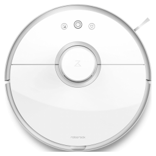

ioBroker mihome-vacuum adapter
=================

[](https://www.npmjs.com/package/iobroker.mihome-vacuum)
[](https://www.npmjs.com/package/iobroker.mihome-vacuum)
[](https://travis-ci.org/iobroker-community-adapters/ioBroker.mihome-vacuum)

[](https://nodei.co/npm/iobroker.mihome-vacuum/)

This adapter allows you control the Xiaomi vacuum cleaner.

## Inhalt
- [Einrichtung](#konfiguration)
    - [Adapter konfigurieren](#adapterkonfiguration)
        - [Steuerung über Alexa](#steuerung-über-alexa)
        - [Zweiter Roboter](#zweiter-roboter)
    - [Einrichtung Valetudo](#valetudo-einrichtung)
- [Funtionen](#funktionen)
    - [S50 Kommandos](#Komandos-des-S50)
	        - [GoTo](#GoTo)
			- [zoneClean](#zoneClean)
            - [Räume](#Räume)
            - [Timer](#Timer)
    - [Eigene Kommandos](#sende-eigene-kommandos)
    - [sendTo-Hook](#eigene-kommandos-per-sendto-schicken)
- [Widget](#widget)
- [Bugs](#bugs)
- [Changelog](#changelog)

## Konfiguration
Derzeit stellt das Ermitteln des Tokens das größte Problem.
Am besten folgt man der Anleitung des folgenden Links:

[Token Vorgehensweise](https://www.smarthomeassistent.de/token-auslesen-roborock-s6-roborock-s5-xiaomi-mi-robot-xiaowa/).

### Fehler bei der Installation
Wenn der Adapter nicht installiert werden kann, kann Canvas nicht installiert werden

``npm ERR! canvas@2.6.1 install: node-pre-gyp install --fallback-to-build
npm ERR! Exit status 1``

Dann müssen folgende Packete und Bibliotheken selber installiert werden:

``
sudo apt-get install build-essential libcairo2-dev libpango1.0-dev libjpeg-dev libgif-dev librsvg2-dev
``

``
sudo npm install canvas --unsafe-perm=true
``


### Adapterkonfiguration
- Bei IP-Adresse muss die IP-Adresse des Roboters eingegeben werden im Format "192.168.178.XX"
- Port des Roboters ist Standardmäßig auf "54321" eingestellt, dies sollte nicht verändert werden
- Eigener Port, sollte nur bei zweiten Roboter geändert werden
- Abfrageintervall Ist die Zeit in ms in der die Statuswerte des Roboters abgerufen werden (sollte nicht <10000 sein)

#### Steuerung über Alexa
In der Konfig add Alexa state aktivieren, ist hier ein Hacken gesetzt wird ein zusätzlicher State erzeugt "clean_home" es ist ein Schalter der bei "true" den Sauger startet und bei "false" fährt er nach Hause, es wird automatisch ein Smartgerät im Cloud Adapter erzeugt mit dem Namen "Staubsauger", dieser kann im Cloud Adapter geändert werden.

#### Zonenreinigung nach pausierung fortsetzen
Wenn diese Option aktiviert ist, wird die Zonenreinigung durch senden des "start" Kommandos automatisch fortzgesetzt.
Wenn die Option deaktiviert ist, wird durch senden von "start" eine neue Komplettreinigung gestartet, auch wenn der Sauger während einer Zonenreinigung pausiert wurde.

- Experimental: Über den Haken bei "Sende eigene Komandos" werden Objekte angelegt, über die man eigene Kommandos an den Roboter senden und empfangen kann.

#### Zweiter Roboter
Sollen zwei Roboter über ioBroker gesteuert werden, müssen zwei Instanzen angelegt werden. Dabei muss bei dem zweiten Roboter der eigene Port (Default: 53421) geändert werden, damit beide Roboter unterschiedliche Ports besitzen.

## Vaetudo Einrichten

Hierfür muss der Roboter gerootet und Valetudo installiert sein. dafür nutzt man am besten folgende Versionen:
[Valetudo RE](https://github.com/rand256/valetudo) oder das normale [Valetudo](https://github.com/Hypfer/Valetudo)


- Aktiviere Valetudo, aktiviert das Mapinterface
- Abrufintervall muss mindestens 1000ms sein, damit wird der Abrufintervall der html Map angegeben
- Map Intervall ist der Intervall für das Map PNG File, welches für Telegramm oder vis genutzt werden kann , hier muss es mindestens 5000ms betragen
- Farben sidn für die Karte folgende Typen können genutzt werden:
```
- #2211FF
- rbg(255,200,190)
- rgba(255,100,100,0.5) //for Transparent
- green
```
- Unter Roboter Bilder kann man verschiedene Bilder auswählen die in der Karte angezeigt werden sollen

### Map Widget
 Am besten kann man die map über ein html widget einbinden einfach den Datempunk binden mit {mihome-vacuum.0.valetudo.map64} wie im unteren Beispiel:

```
[{"tpl":"tplHtml","data":{"g_fixed":false,"g_visibility":false,"g_css_font_text":false,"g_css_background":false,"g_css_shadow_padding":false,"g_css_border":false,"g_gestures":false,"g_signals":false,"g_last_change":false,"visibility-cond":"==","visibility-val":1,"visibility-groups-action":"hide","refreshInterval":"0","signals-cond-0":"==","signals-val-0":true,"signals-icon-0":"/vis/signals/lowbattery.png","signals-icon-size-0":0,"signals-blink-0":false,"signals-horz-0":0,"signals-vert-0":0,"signals-hide-edit-0":false,"signals-cond-1":"==","signals-val-1":true,"signals-icon-1":"/vis/signals/lowbattery.png","signals-icon-size-1":0,"signals-blink-1":false,"signals-horz-1":0,"signals-vert-1":0,"signals-hide-edit-1":false,"signals-cond-2":"==","signals-val-2":true,"signals-icon-2":"/vis/signals/lowbattery.png","signals-icon-size-2":0,"signals-blink-2":false,"signals-horz-2":0,"signals-vert-2":0,"signals-hide-edit-2":false,"lc-type":"last-change","lc-is-interval":true,"lc-is-moment":false,"lc-format":"","lc-position-vert":"top","lc-position-horz":"right","lc-offset-vert":0,"lc-offset-horz":0,"lc-font-size":"12px","lc-font-family":"","lc-font-style":"","lc-bkg-color":"","lc-color":"","lc-border-width":"0","lc-border-style":"","lc-border-color":"","lc-border-radius":10,"lc-zindex":0,"html":"{mihome-vacuum.0.valetudo.map64}"},"style":{"left":"0","top":"0","width":"100%","height":"100%"},"widgetSet":"basic"}]
```

Der zweite Weg ist über ein src img Widget, hier einfach den Datenpunkt PNG auswählen, dieses wird aber nicht so oft aktualisiert wie die html Version.

## Funktionen

### Komandos des S50 (second Generation)
Die die Kartengröße immer 52000mm x 52000mm somit sind Werte von 0 bis 51999mm möglich.
Leider kann die Position und die und die Lage der Karte nciht abgefragt werden, dieses kann sich von Saugvorgang zu Saugvorgang ändern. Genutzt als basis wird immer die letzte Saugkarte, wie auch in der App.
Saugt der Roboter nur ein Bereich und baut die Karte immer gleich auf, kann man ihn zuverlässig zu Orten schicken oder Bereich eSaugen lassen.

#### GoTo
Um dem Staubsauger zu einem Punkt fahren zu lassen muss das Objekt "goTo" wie folgt befüllt werden:
```
xVal,yVal
```
Die Werte müssen den oben genannten Gültigkeitsbereich erfüllen und geben die x und y Koordinate auf der Karte an.

Beispiel:
```
24850,26500
```


#### zoneClean
Zum Saugen einer Zone muss ZoneClean wie folgt befüllt werden:
```
[x1,y1,x2,x2,count]
```
Wobei x und y die Koordinaten des Rechteckigen Bereiches sind und "count" die Reinigunsvorgänge.
Man kann auch mehrere Bereiche auf einmal saugen lassen:

```
[x1,y1,x2,x2,count],[x3,y3,x4,x4,count2]
```

Beispiel:
```
[24117,26005,25767,27205,1],[24320,24693,25970,25843,1]
```
#### Räume
neuere Sauger unterstützen mit der neuesten miHome App die Definition von Räumen, siehe 
[Video](https://www.youtube.com/watch?v=vEiUZzoXfPg)

Dabei hat jeder Raum in der aktuellen Karte einen Index. Dieser wird dann dem Raum aus der App zugewiesen.
Vom Roboter bekommen wir dann nur ein Mapping mit Raumnummer und Index.
Der Adapter fragt diese Räume jedesmal beim Adapter start ab und erstellt für jeden Raum einen channel, der dann den aktuellen RaumIndex kennt. Manuell passiert dasselbe mit dem Button loadRooms.
Dieser channel kann dann den ioBroker-Räumen zugeordnet werden. Wenn dann der Button roomClean gedrück wird, wird der Index der Karte ermittelt und dieser dann an den Roboter geschickt, so dass der dann gezielt diesen Raum saugt. Vorher wird bei Einzelraum Saugung noch die FAN-Power eingestellt.
Wenn man in der App die Möglichkeit zum Benennen der Räume noch nicht hat, gibt es noch die Möglicheit manuell solche channel zu erzeugen indem man den Map Index angibt. Zusätzlich kann man anstelle des mapIndex jetzt auch die Koordinaten einer Zone eingeben.
Wenn man spontan mal mehrere Räume reinigen will, kann man das über multiRoomClean tun, indem man diesem Datenpunkt die ioBroker-Räume zuweist und dann den Butten drückt.

#### Timer
Sobald der Sauger die Raumfunktion (siehe oben) unterstützt, kann man auch Timer erstellen, die dann die entsprechenden Raum-channel antriggert, bzw. dessen mapIndex ermittelt.
Ein Timer kann entweder Räume antriggern und/oder auch direkt Raum Channels.
Die Timer selber werden über den config Bereich erstellt, wird dann aber zu einem Datenpunkt. Dort kann jeder Timer dann aktiviert/deaktiviert werden oder auch einmalig übersprungen werden. Auch ein direkt Start ist möglich.

Der Vorteil der ioBroker timer sind zum einen, dass die auch in der VIS angezeigt bzw. dort genutzt werden können und der Roboter auch vom Internet getrennt werden, da die Timer der App aus China getriggert werden.

### Sende eigene Kommandos
HINWEIS: Diese Funktion sollte nur von Experten genutzt werden, da durch falsche Kommandos der sauger zu Schaden kommen könnte

Der Roboter unterscheidet bei den Kommandos in Methoden (method) und Parameter(params) die zur spezifizierung der Methoden dienen.
Under dem Object "mihome-vacuum.X.control.X_send_command" können eigene Kommandos an den Roboter gesendet werden.
Der Objektaufbau muss dabei wiefolgt aussehen: method;[params]

Unter dem Objekt "mihome-vacuum.X.control.X_get_response" wird nach dem Absenden die Antwort vom Roboter eingetragen. Wurden Parameter abgefragt erscheinen sie hier im JSON Format, wurde nur ein Befehl gesendet, antwortet der Roboter nur mit "0".

Folgende Methoden und Parameter werden unterstützt:

| method          | params                                                              | Beschreibung                                                                                           |
|-----------      |-------                                                              |-------------------                                                                                     |
| get_timer       |                                                                     |       liefert den eingestellten Timer zurück                                                           |
| set_timer       | [["ZEIT_IN_MS",["30 12 * * 1,2,3,4,5",["start_clean",""]]]]         |     Einstellen der Saugzeiten BSp. 12 Uhr 30 an 5 Tagen                                                |
| upd_timer       | ["1481997713308","on/off"]                                          |     Timer aktivieren an/aussehen                                                                       |
|                 |                                                                     |                                                                                                        |
| get_dnd_timer   |                                                                     |       Lifert die Zeiten des Do Not Distrube zurück                                                     |
| close_dnd_timer |                                                                     |       DND Zeiten löschen                                                                               |
| set_dnd_timer   |   [22,0,8,0]                                                        |       DND Einstellen h,min,h,min                                                                       |
|                 |                                                                     |                                                                                                        |
|app_rc_start     |                                                                     | Romote Control starten                                                                                 |
|app_rc_end       |                                                                     | Romote Control beenden                                                                                 |
|app_rc_move      |[{"seqnum":'0-1000',"velocity":WERT1,"omega":WERT2,"duration":WERT3}]| Bewegung. Sequenznummer muss fortlaufend sein, WERT1(Geschw.) = -0.3 - 0.3, WERT2(Drehung) = -3.1 - 3.1, WERT3(Dauer)|

Mehr Mehtoden und Parameter können sie hier finden ([Link](https://github.com/MeisterTR/XiaomiRobotVacuumProtocol)).

### Eigene Kommandos per sendTo schicken
Es ist auch möglich, per `sendTo` eigene Kommandos aus anderen Adaptern zu senden. Die Benutzung ist wie folgt:
```
sendTo("mihome-vacuum.0", "sendCustomCommand", 
    {method: "method_id", params: [...] /* optional*/}, 
    function (response) { /* Ergebnis auswerten */}
);
```
mit `method_id` und `params` nach obiger Definition.

Das `response` Objekt hat zwei Eigenschaften: `error` und (sofern kein Fehler aufgetreten ist) `result`.

Eine handvoll vordefinierter Kommandos kann auch folgendermaßen abgesetzt werden:
```
sendTo("mihome-vacuum.0", 
    commandName, 
    {param1: value1, param2: value2, ...}, 
    function (response) { /* do something with the result */}
);
```
Die unterstützten Kommandos sind:

| Beschreibung | `commandName` | Erforderliche Parameter | Anmerkungen |
|---|---|---|---|
| Saugprozess starten | `startVacuuming` | - keine - |  |
| Saugprozess beenden | `stopVacuuming` | - keine - |  |
| Saugprozess pausieren | `pause` | - keine - |  |
| wartende Aufträge löschen | `clearQueue` | - keine - |  |
| Einen kleinen bereich um den Roboter saugen | `cleanSpot` | - keine - |  |
| Zurück zur Ladestation | `charge` | - keine - |  |
| "Hi, I'm over here!" sagen | `findMe` | - keine - |  |
| Status der Verbrauchsmaterialien prüfen (Bürste, etc.) | `getConsumableStatus` | - keine - |  |
| Status der Verbrauchsmaterialien zurücksetzen (Bürste, etc.) | `resetConsumables` | - keine - | Aufrufsignatur unbekannt |
| Eine Zusammenfassung aller vorheriger Saugvorgänge abrufen | `getCleaningSummary` | - keine - |  |
| Eine detaillierte Zusammenfassung eines Saugvorgangs abrufen | `getCleaningRecord` | `recordId` |  |
| Karte auslesen | `getMap` | - keine - | Unbekannt, was mit dem Ergebnis getan werden kann |
| Aktuellen Status des Roboters auslesen | `getStatus` | - keine - |  |
| Seriennummer des Roboters auslesen | `getSerialNumber` | - keine - |  |
| Detaillierte Geräteinfos auslesen | `getDeviceDetails` | - keine - |  |
| *Nicht-stören*-Timer abrufen | `getDNDTimer` | - keine - |  |
| Neuen *Nicht-stören*-Timer festlegen | `setDNDTimer` | `startHour`, `startMinute`, `endHour`, `endMinute` |  |
| *Nicht-stören*-Timer löschen | `deleteDNDTimer` | - keine - |  |
| Saugstufe abrufen | `getFanSpeed` | - keine - |  |
| Saugstufe festlegen | `setFanSpeed` | `fanSpeed` | `fanSpeed` ist eine Zahl zwischen 1 und 100 |
| Fernsteuerungsfunktion starten | `startRemoteControl` | - keine - |  |
| Bewegungskommando für Fernsteuerung absetzen | `move` | `velocity`, `angularVelocity`, `duration`, `sequenceNumber` | sequenceNumber muss sequentiell sein, Dauer ist in ms |
| Fernsteuerungsfunktion beenden | `stopRemoteControl` | - keine - |  |
| Raum/Räume saugen | `cleanRooms` | `rooms` | `rooms` ist ein komma separierter String mit enum.rooms.XXX |
| Segment saugen | `cleanSegments` | `rooms` | `rooms` ist Array mit mapIndex oder komma separierter String mit mapIndex |
| Zone saugen | `cleanZone` | `coordinates` | `coordinates` ist ein String mit coordinaten und die Anzahl Durchläufe, siehe [zoneClean](#zoneClean) |

## Widget
Zur Zeit leider noch nicht fertig.


## Bugs
- gelegentliche Verbindungsabbrüche dies liegt jedoch nicht am Adapter sondern meistens am eigenen Netzwerke
- Widget zur Zeit ohne Funktion

## Changelog
### 2.0.8 (2020-02-26)
* (dirkhe) verminderte Kommunikation mit dem Roboter
### 2.0.7 (2020-02-25)
* (dirkhe) Fortsetzten nach Pause für Räume hinzugefügt
* (MeisterTR) fix config
### 2.0.6 (2020-02-17)
* (MeisterTR) Raumerkennung für S50 über die Karte (cloud oder Valetudo vorrausgesetzt)
### 2.0.4 (2020-02-13)
* (MeisterTR) Token über cloud hinzugefügt
* (MeisterTR) Map über Cloud hinzugefügt
* (MeisterTR) Neues und altes Kartenformat hinzugefügt
* (MeisterTR) Config Seite überholt
### 1.10.5 (2020-02-11)
* sende Ping nur, wenn nicht verbunden, sonst get_status
* Setzte Button Status auf true, wenn geklickt
* Timermanager und roomManager in eigene libs ausgelagert

### 1.10.4 (2020-02-06)
* (MeisterTR )Unterstützung für Valetudo-Karten für Gen3 und Gen2 2XXX

### 1.10.1 (2020-01-20)
* (dirkhe) zonen können jetzt auch als Räume angelegt werden
* (dirkhe) timer können Rum Channels direkt antriggern

### 1.10.0 (2020-01-17)
* (dirkhe) Raumhandling hinzugefügt
* (dirkhe) Timer hinzugefügt
* (dirkhe) Featurehandling angepasst

### 1.1.6 (2018-12-06)
* (JoJ123) Saugleistung für Wischmodus hinzugefügt (S50+).

### 1.1.5 (2018-09-02)
* (BuZZy1337) Beschreibung für Status 16 and 17 hinzugefügt (goTo und zonecleaning).
* (BuZZy1337) Einstellung für automatische Fortsetzung einer pausierten Zonenreinigung hinzugefügt.

### 1.1.4 (2018-08-24)
* (BuZZy1337) Funktion zum Fortsetzen einer vorher pausierten Zonenreinigung hinzugefügt. (State: mihome-vacuum.X.control.resumeZoneClean)

### 1.1.3 (2018-07-11)
* (BuZZy1337) Fehler im ZoneCleanup state behoben (Roboter fuhr nur kurz von der Ladestation, meldete "Zonecleanup Finished" und fuhr sofort wieder zurück zur Ladestation)

### 1.1.2 (2018-07-05)
* (BuZZy1337) Fehler in Erkennung von neuer Firmware / zweiter Generation Roboter behoben

### 1.1.1 (2018-04-17)
* (MeisterTR) Fehler abgefangen, Objekte für neue fw hinzugefügt

### 1.0.1 (2018-01-26)
* (MeisterTR) ready for admin3
* (MeisterTR) support SpotClean and voice level (v1)
* (MeisterTR) support second generation (S50)
* (MeisterTR) Speed up data requests

### 0.6.0 (2017-11-17)
* (MeisterTR) use 96 char token from Ios Backup
* (MeisterTR) faster connection on first use

### 0.5.9 (2017-09-18)
* (MeisterTR) fix communication error without i-net
* (AlCalzone) add selection of predefined power levels

### 0.5.7 (2017-08-17)
* (MeisterTR) compare system time and Robot time (fix no connection if system time is different)
* (MeisterTR) update values if robot start by cloud

### 0.5.6 (2017-07-23)
* (MeisterTR) add option for crate switch for Alexa control

### 0.5.5 (2017-06-30)
* (MeisterTR) add states, fetures, fix communication errors

### 0.3.2 (2017-06-07)
* (MeisterTR) fix no communication after softwareupdate(Vers. 3.3.9)

### 0.3.1 (2017-04-10)
* (MeisterTR) fix setting the fan power
* (bluefox) catch error if port is occupied

### 0.3.0 (2017-04-08)
* (MeisterTR) add more states

### 0.0.2 (2017-04-02)
* (steinwedel) implement better decoding of packets

### 0.0.1 (2017-01-16)
* (bluefox) initial commit
